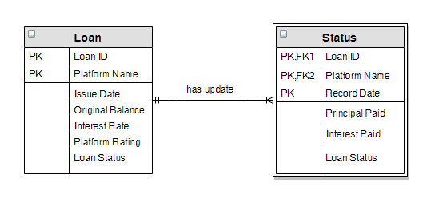
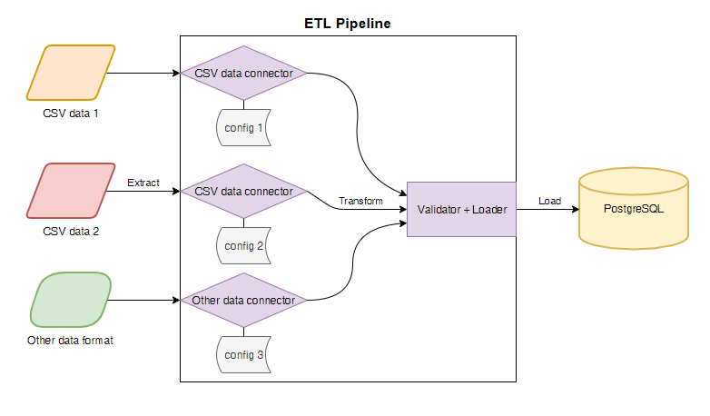

#Implementation Plan (version 1)

This will be the plan of v1 of the application. Once it is implemented and based on whether I decide to focus on analysis or ETL, I will create a v2 implementation plan where I will expand upon the schema/architecture.

This plan will consist of two parts: (1) the database schema, and (2) the architecture for the ETL application.

## Schema

The following represents the basic schema as an ER diagram which includes the essential datapoints. Note that "Principal remaining" has been omitted as it is a computed value of "original balance" and "principal paid". Also note that "Loan Status" is a repeated attribute between both tables: this is intentional to provide insight on overall loan status vs specific time at which loan status changed.

The data will be an aggregate of data across all platforms. The schema will consist of 2 tables which establish a relationship between a loan and its periodic status updates.  New attributes have been created as follows:

* Platform name (loan table) - the unique identifier for the platform.
* Record date (status table) - date at which record was generated, this can either be the upload date or a user-specified date (for corrections).

## Architecture

The ETL will be a batch pipeline that can be run by a job scheduler like Control-M or Airflow. The architecture of the ETL is as follows.

The ETL will feature connectors: new connectors can be implemented in code, and configuration files tailor each instance of a connector to a specific data source. These connectors will load and transform the data to the target schema. The ETL will then validate the data and load the data via sqlalchemy into the target PostgreSQL database.

The code when implemented this way will lay the foundation for migration to a distributed cloud solution. While this version of the implementation is neither optimally efficient nor fault-tolerant, I imagine a Spark + Amazon EMR + AWS Batch/Lambda implementation will address these problems.

### Features

Based on the architecture, we can distill the requirements down to 4 features:

1. **Data Connectors**: The ETL pipeline should define connectors to different data source types. These connectors should transform source data format into a common intermediate format for loading into the database.
2. **Database Connectors**: The ETL pipeline should define modular database connectors which will allow loading to multiple destinations and database types.
3. **Data Sanitization**: The ETL pipeline should be able to perform basic cleanup of data from datasources and report data errors.
4. **Pipeline Config Files**: The ETL pipeline should consult a list of configuration files which orchestrate the previous three features for each data source.
